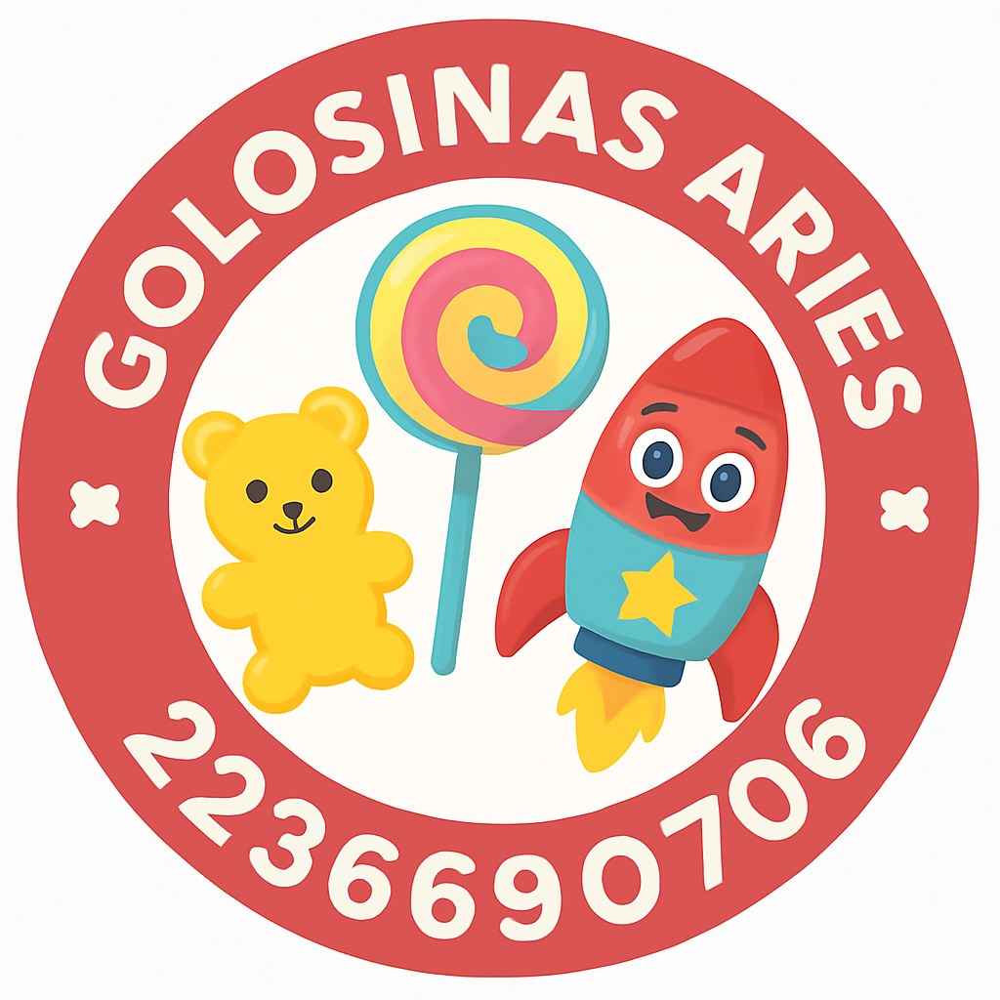

# 🍭 Golosinas Aries 

Catálogo digital de productos desarrollado para **Golosinas Aries**, pensado para facilitar la visualización y pedido de golosinas de manera simple, rápida y visual.

## 🛍️ Descripción

Este proyecto es un **catálogo web interactivo** donde los clientes pueden explorar productos, agregarlos al carrito y enviar su pedido directamente por **WhatsApp**.  
Fue desarrollado con foco en la **facilidad de uso**, **compatibilidad móvil** y una estética colorida y amigable.

## ⚙️ Tecnologías utilizadas

- **HTML5**, **CSS3** y **JavaScript**
- Envío de pedidos por **WhatsApp API**
- Manejo dinámico del carrito de compras
- Diseño adaptable (**responsive**) para móviles

## 🧠 Objetivo

Simplificar el proceso de compra online de golosinas y mejorar la comunicación entre el cliente y la empresa.

## 📱 Vista previa

Podés acceder al proyecto desde:  
👉 [https://ornelabaldini.github.io/Golosinas_Aries/](https://ornelabaldini.github.io/Golosinas_Aries/)

---

💬 **Desarrollado por:** [Ornela Baldini](https://github.com/ornelabaldini)
